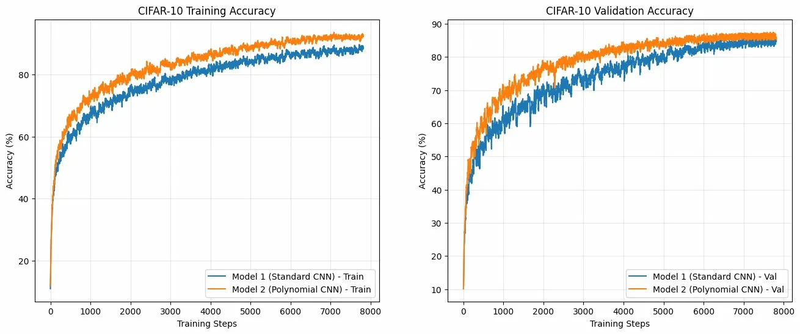
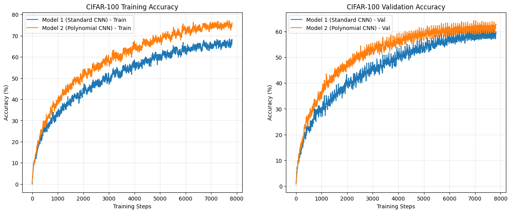
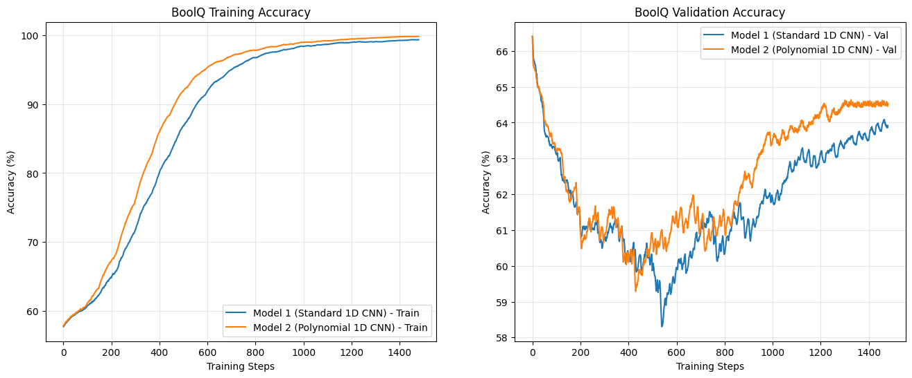
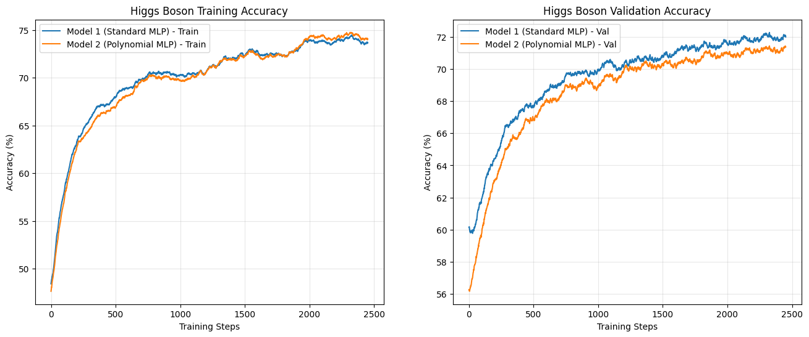

# Polynomial Neural Networks

**Oporture** — investigation into polynomial neurons as a drop-in replacement for standard linear neurons in convolutional architectures.

---

## Overview

Standard artificial neurons compute a weighted sum of their inputs before applying a nonlinearity. All expressive power comes from stacking many such layers. This project investigates a simple modification: replacing the linear dot product with a second-degree polynomial, allowing a single neuron to capture multiplicative interactions between inputs directly.

---

## Method

A standard convolutional layer computes:

```
y = Conv(x) + b
```

Our `PolyConv` layer computes:

```
y = Conv₁(x) + Conv₂(x) × Conv₃(x)
```

The product of two linear maps captures a rich set of second-order interactions implicitly, without requiring an explicit O(N²) parameter expansion.

The same idea applies to fully connected layers via `PolyLinear`:

```python
class PolyLinear(nn.Module):
    def __init__(self, in_features, out_features):
        super().__init__()
        self.linear1 = nn.Linear(in_features, out_features)
        self.linear2 = nn.Linear(in_features, out_features)
        self.linear3 = nn.Linear(in_features, out_features)

    def forward(self, x):
        return self.linear1(x) + self.linear2(x) * self.linear3(x)
```

---

## Results

All comparisons are parameter-matched, both models have approximately the same number of trainable parameters. Standard model uses full channel width; polynomial model uses reduced width to compensate for the 3× parameter cost of PolyConv.

| Dataset | Task | Architecture | Standard CNN | Polynomial CNN | Delta |
|---|---|---|---|---|---|
| CIFAR-10 | Image classification | 2D CNN | ~85% | ~88% | **+3%** |
| CIFAR-100 | Image classification | 2D CNN | ~60% | ~63% | **+3%** |
| BoolQ | Reading comprehension | 1D CNN | ~63.5% | ~64.5% | **+1%** |
| Higgs Boson | Particle classification | MLP | ~72% | ~71.5% | **-0.5%** |

### CIFAR-10


### CIFAR-100


### BoolQ


### Higgs Boson


---

## Key Findings

Polynomial neurons consistently outperform linear neurons in convolutional settings. Across CIFAR-10, CIFAR-100, and BoolQ, the polynomial model achieves higher validation accuracy at identical parameter counts, with faster convergence in early training.

However, the advantage does not appear to transfer to MLP settings. On Higgs Boson tabular data, the standard MLP matches or slightly outperforms the polynomial MLP.

In all experiments, the train-val gap for the polynomial model is comparable to the standard model, indicating the additional expressivity is being used for generalization rather than memorization.

---

## Implementation

```python
class PolyConv2d(nn.Module):
    def __init__(self, in_channels, out_channels, kernel_size, 
                 stride=1, padding=0, bias=False):
        super().__init__()
        self.conv1 = nn.Conv2d(in_channels, out_channels, kernel_size, 
                                stride, padding, bias=bias)
        self.conv2 = nn.Conv2d(in_channels, out_channels, kernel_size, 
                                stride, padding, bias=False)
        self.conv3 = nn.Conv2d(in_channels, out_channels, kernel_size, 
                                stride, padding, bias=False)

    def forward(self, x):
        return self.conv1(x) + self.conv2(x) * self.conv3(x)
```

`PolyConv2d` is a drop-in replacement for `nn.Conv2d`. To use in an existing architecture, replace conv layers and reduce channel width by ~`1/√3` to maintain parameter parity.

---

## Reproducing Results

```bash
git clone https://github.com/Oporture/PNN
cd PNN/training-scripts
pip install -r requirements.txt
# CIFAR-10
python3 CIFAR-10.py
# CIFAR-100
python3 CIFAR-100.py
# BoolQ
python3 BoolQ.py
# Higgs
python3 Higgs.py
```

---

## Related Work

- **Product Unit Networks** (Durbin & Rumelhart, 1989) — early exploration of multiplicative neurons
- **Kolmogorov-Arnold Networks** (Liu et al., 2024) — learnable activation functions per connection, related motivation
- **Pi-nets / Polynomial Networks** (Chrysos et al., 2021) — recent work on polynomial neural networks

---

## About

This research is conducted by [Oporture](https://github.com/Oporture), an AI research organization focused on safe and responsible AI research.
